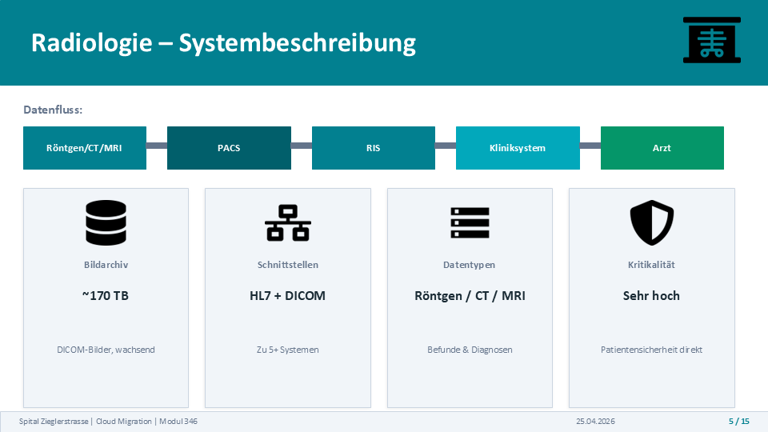
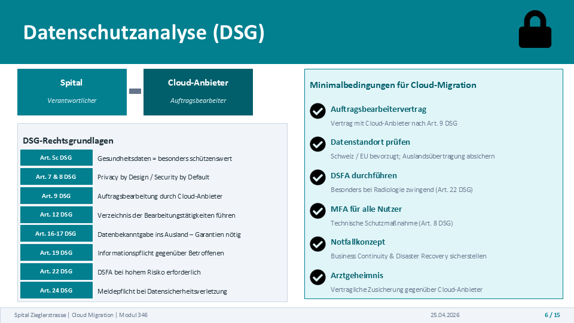
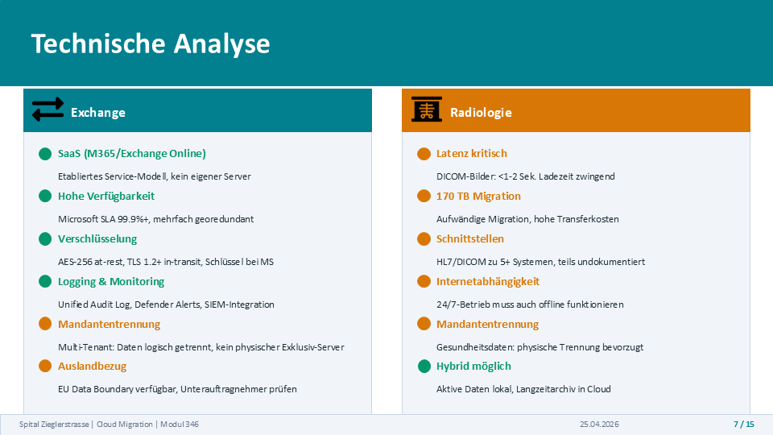
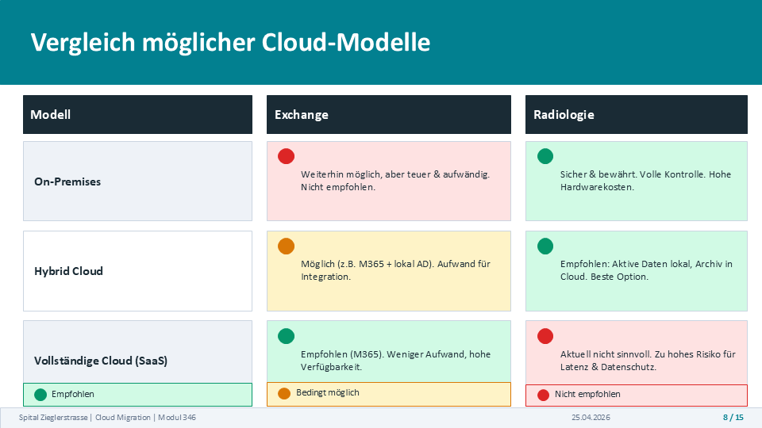
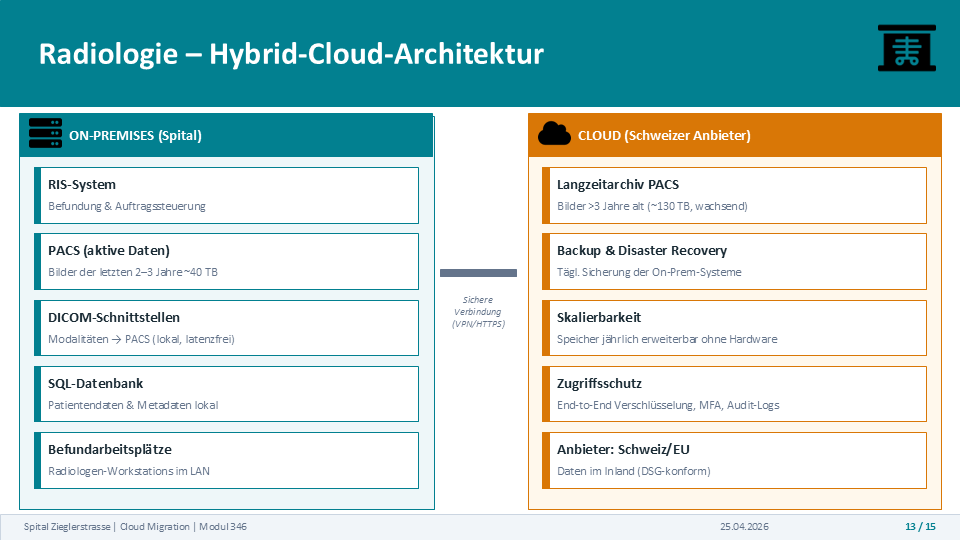
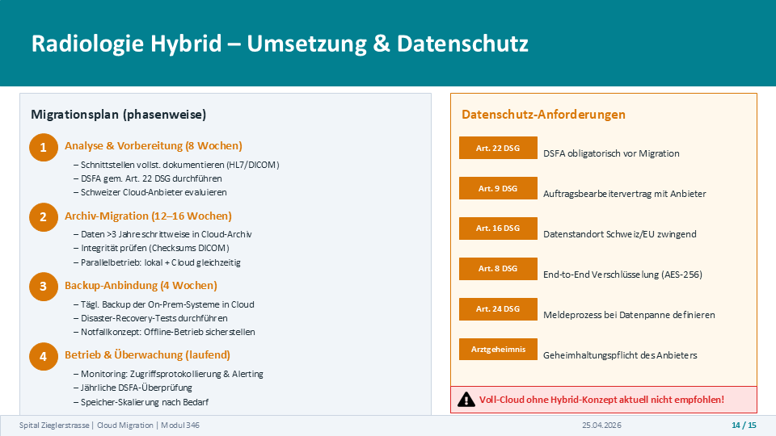

# Healthcare Cloud Migration Assessment

## Overview

This project evaluates the feasibility of migrating selected IT systems of a fictional Swiss hospital to cloud-based infrastructure.

The assessment was created as part of **Module 346 – Cloud Solutions** and focuses on two systems:

- Microsoft Exchange
- Radiology Information System (RIS) and Picture Archiving and Communication System (PACS)

The objective was not to perform an actual migration, but to evaluate whether cloud adoption would be technically, operationally and legally appropriate for each system.

The assessment considers Swiss data protection requirements, system criticality, infrastructure dependencies, security, availability and different cloud deployment models.

---

## Scenario

The fictional **Spital Zieglerstrasse** operates primarily on-premises IT infrastructure.

The environment includes approximately:

- 930 employees
- 230 hospital beds
- 55 virtual servers
- Microsoft Exchange 2019
- Active Directory
- RIS/PACS infrastructure
- approximately 170 TB of radiology image data

The hospital wants to determine whether moving Exchange and radiology services to the cloud could reduce operational effort while maintaining security, availability and regulatory compliance.

---

## Systems Assessed

### Microsoft Exchange

The existing Exchange environment provides:

- email communication
- calendars and contacts
- mobile synchronization
- internal communication
- integration with Active Directory

The assessment considers whether the existing on-premises Exchange infrastructure could be replaced or supplemented by a cloud-based service such as Exchange Online.

### Radiology – RIS/PACS

The radiology environment consists of two major components.

**RIS – Radiology Information System**

The RIS supports radiology workflows and manages:

- patient information
- appointments
- examination orders
- medical findings and reports
- HL7 communication with clinical systems

**PACS – Picture Archiving and Communication System**

The PACS manages medical imaging data and provides:

- storage of X-ray, CT and MRI images
- DICOM-based image transfer
- image archiving
- digital access to images for medical staff

The environment contains approximately **170 TB of imaging data** and continues to grow.

The radiology environment is highly critical because system availability can directly affect diagnosis, treatment and emergency workflows.

---

## Data Protection Assessment

Both systems may process personal data, while the radiology environment processes particularly sensitive health information.

The assessment therefore considered requirements of the **Swiss Federal Act on Data Protection (DSG)**, including:

- processing of sensitive personal data
- responsibilities of the hospital and cloud provider
- data processing agreements
- data location and international data transfers
- access control
- information security
- data breach procedures
- Data Protection Impact Assessment (DSFA)
- medical confidentiality

Based on the assessed risk profile, the analysis concluded that a DSFA should be performed before migrating sensitive radiology workloads to cloud infrastructure.

Technical and organizational safeguards such as MFA, encryption, logging, access control and disaster-recovery procedures would also be required.

---

## Technical Assessment

The technical requirements of Exchange and radiology differ significantly.

### Exchange

Cloud-based Exchange can benefit from:

- established SaaS services
- high availability
- centralized updates
- encryption
- logging and monitoring
- reduced local infrastructure requirements

Important considerations include tenant separation, identity integration and potential international data processing.

### Radiology

Radiology introduces additional technical challenges:

- approximately 170 TB of existing image data
- continuously growing storage requirements
- latency-sensitive image access
- HL7 and DICOM interfaces
- integration with multiple clinical systems
- high availability requirements
- dependency on network connectivity
- emergency and offline operation

These requirements make a complete cloud migration considerably more complex than the Exchange migration.

---

## Cloud Model Comparison

Three deployment approaches were evaluated:

### On-Premises

Systems remain within the hospital infrastructure.

**Advantages**

- direct infrastructure control
- reduced dependency on external connectivity
- established local integrations

**Challenges**

- hardware lifecycle management
- maintenance effort
- limited scalability
- local responsibility for availability and recovery

### Hybrid Cloud

Selected components remain on-premises while other services or data are moved to cloud infrastructure.

This model allows critical and latency-sensitive components to remain close to hospital systems while using cloud resources for scalable workloads.

### Full Cloud

Applications and data are hosted primarily by cloud providers.

This provides scalability and can reduce local infrastructure requirements, but increases dependency on connectivity, providers and cloud-specific operational processes.

---

## Proposed Radiology Hybrid Architecture

The assessment identified a hybrid architecture as a suitable approach for the radiology scenario.

### On-Premises

The following components remain within the hospital:

- RIS
- active PACS data
- DICOM interfaces
- SQL database
- radiology workstations

Keeping these components local supports low-latency access and maintains integration with medical equipment and clinical systems.

### Cloud

Cloud infrastructure can be used for:

- long-term PACS archiving
- backup
- disaster recovery
- scalable storage

Communication between the environments should use secure encrypted connections.

Additional safeguards include:

- end-to-end encryption
- MFA
- audit logging
- controlled provider access
- appropriate data-location requirements

---

## Migration Approach

A potential radiology migration was divided into several phases.

### 1. Analysis and Preparation

- document HL7 and DICOM interfaces
- perform a Data Protection Impact Assessment
- evaluate suitable cloud providers
- define security and compliance requirements

### 2. Archive Migration

- migrate older imaging data gradually
- verify DICOM integrity
- operate local and cloud environments in parallel during transition

### 3. Backup and Disaster Recovery

- establish cloud-based backups
- test disaster-recovery procedures
- define emergency and offline operation

### 4. Operations and Monitoring

- monitor access and security events
- review data-protection risks
- maintain logging and alerting
- scale storage according to demand

---

## Assessment Result

The two systems require different cloud strategies.

### Exchange

A cloud-based approach is feasible, provided that data protection, identity management, security, contractual requirements and backup considerations are addressed.

### Radiology

A complete cloud migration introduces significant challenges because of:

- the large data volume
- latency requirements
- clinical system integrations
- DICOM and HL7 interfaces
- availability requirements
- sensitive health information

For the assessed scenario, a **hybrid architecture** was identified as the preferred approach: operational and latency-sensitive radiology components remain on-premises while cloud infrastructure supports long-term storage, backup and disaster recovery.

---

## Skills Demonstrated

This project demonstrates experience with:

- cloud migration assessment
- cloud deployment models
- hybrid-cloud architecture
- healthcare IT concepts
- RIS/PACS
- DICOM and HL7
- Swiss data protection requirements
- security and risk analysis
- business continuity and disaster recovery
- technical architecture evaluation
- migration planning

---

## Project Scope

This repository documents an **architecture and migration assessment**.

No production hospital systems, patient data or real healthcare infrastructure were used or migrated as part of this project.
